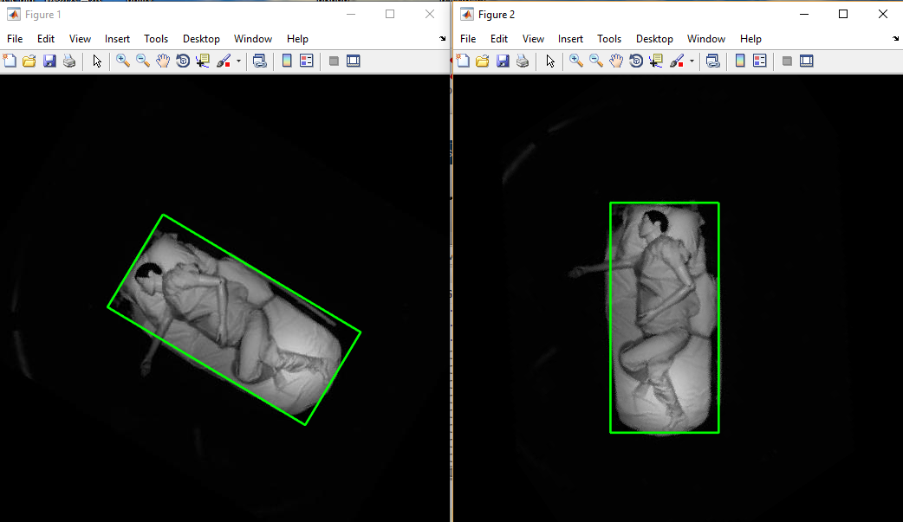

# CPM for mannequin pose estimation
Shuangjun Liu, Yu Yin, Sarah Ostadabbas 
"[In-Bed Pose Estimation: Deep Learning with Shallow Dataset](https://arxiv.org/abs/1711.01005)", arXiv

This code is based on the original "[Convolutional Pose Machines](http://arxiv.org/abs/1602.00134)" caffe version, CVPR 2016.

We hook up our data to original CPM for your convenience. 
You can also only download our [minimal version](http://www.coe.neu.edu/Research/AClab/pose/CPM_MANNE_min.zip) which includes our pretrianed model and network definition prototxt file and hook up everything to original CPM. 

Besides CPM pose estimation, we also provides toolkit towards practical application including on-demand estimation trigger, bed orientation detection based on 2-end HOG pose rectification.  

Contact: Shuangjun Liu (shuliu@ece.neu.edu, shuangjunliu16@gmail.com)  
Sarah Ostadabbas (ostadabbas@ece.neu.edu)

## Before Everything
- If you only need to run the code. You can simply download our code model and run the test on normal caffe.
- If you need training. Please download the [CPM caffe](https://github.com/shihenw/caffe) with customized layers. 
- Please refer the original CPM for environment setting for training. It include compiled python and matlab interface. 
Ubuntu 14.04, OpenCV 2.4.10, CUDA 8.0, CUDNN 5. 

## Testing
Please download our dataset and  our pretrained model from our [website](http://www.northeastern.edu/ostadabbas/2016/09/01/a-vision-based-system-for-in-bed-posture-tracking/). 
Unzip the model in the model folder.
In our work, [271-300,401-419] are employed for testing. Rest for training. 

Or you can train the model yourself as instructed in training session.  
Or you can download the original CPM pretrained model with testing/get_model.sh to test the performance on our IRS data.  

### Matlab
1. CPMtest2_rl.m: Show a demo pose estimation on our sample IRS image. Default model is number 6 with our optimal training strategy. You can also change it in config1.m to other model for comparison. 

2. `bchTestM6.m`: Run the model on test benchmark with model 6 and save the prediction result in predicts folder. 
Note, in our original design, we evaluate on the whole dataset for furthere reference. To calculate the accuracy, please index out test corresponding result for accuracy evaluation. [271-300,401-409].
3. Our test results are already included in this code for different training strategy. Only the portrait view result is included. You can also test on multiple lying direction to check the performance. 

## Training
- Download the CPM pretrianed model via test/get_model.sh.  
- Run genJSONv5_rl('MANNE_GRAY') to generate a json file in `training/json/` folder. This will only include the training samples in the dataset. Our   
- Run `genLMDBv4_rl.py` to generate LMDBs for CPM data layer in [CPM caffe](https://github.com/shihenw/caffe). Change the main function to select dataset, and note that you can generate a LMDB with multiple datasets.  
- Our network definition prototxt files are already included in this code release.  
- Train our model with weights initialized by the CPM pretraind model. We employ their best performance model for initial weights. (pose_iter_985000_addLEEDS.caffemodel)  

Note:  

1. pose_train_testFTS1_6.prototxt.  
Train the fc layers of first and last stage only.

2. pose_train_testFTS1-6.prototxt.
Train fc layers across all 6 stages.

3. pose_train_testFTS1-6S2C3.prototxt.
Train fc layers across all 6 stages. The stage 2 convolutional layer 3 is also included. 

4. pose_train_testFTS6.prototxt.
Follow the traditional fine tune rule. Only train the very last fc layer of the whole network.

When training, please modify the pose_solver.prototxt for the fine tuning strategy you like. The total iterations can also altered here. 

## On-demand Estimation Trigger 
On-demand trigger codes are located in folder onDemTrigger/. A demo video is provided as 'pose1.mov'. 
Simply run the `s_findAgState.m` which will find the trigger point when the state comes to stable from previous aggitation. A trigger plot will also show up.  

## Orientation Detection 

As mentioned in the paper that lying orientation has huge impact on pose estimation performance. Here we provide 2-end HOG rectification method. Combined with the minmal bounding box detection it can work on random orientation rectifciation.  
Codes are located inside ortDetection/.
Before running the code, you need download the dataset mentioned above and set the data path correctly. For testing, you also need to download the [random oriented version](http://www.coe.neu.edu/Research/AClab/pose/BW3SC0_2_20170331_rndOrt.zip).  
`imgRt` to the 'YOUR_PATH/BW3MltSC0_2_170331' which contains 4 standard directions. 
`imgRtTest` to 'YOUR_PATH/BW3SC0_2_20170331_rndOrt' 

To run the code, 

1. run the `s_gen2endHogFts.m`  to generate hog features from image 

2. run `s_genOrtMdlAug.m` to generate the 2-end rectification model.  

3. run `s_pdctOrts.m` to show rectification result. 

## Citation
Please cite our paper if it helps your research:

    @article{liu2017bed,
      title={In-Bed Pose Estimation: Deep Learning with Shallow Dataset},
      author={Liu, Shuangjun and Yin, Yu and Ostadabbas, Sarah},
      journal={arXiv preprint arXiv:1711.01005},
      year={2017}
    }
